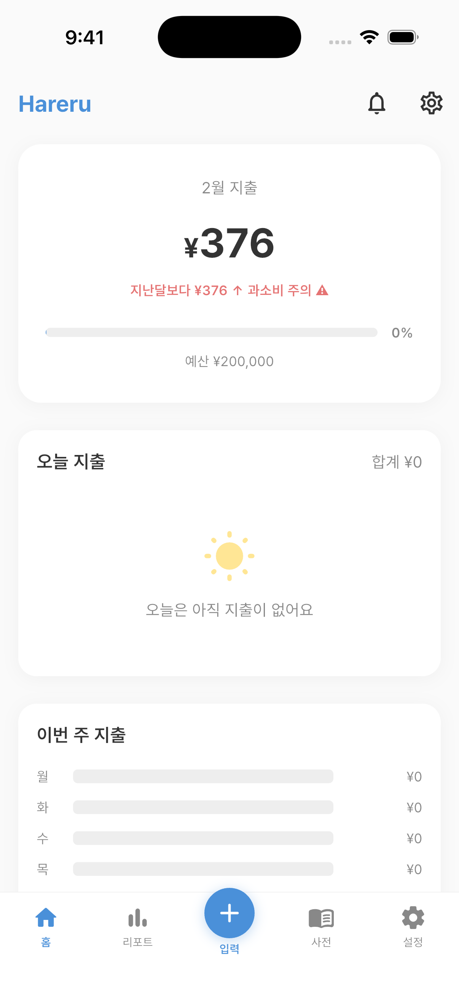
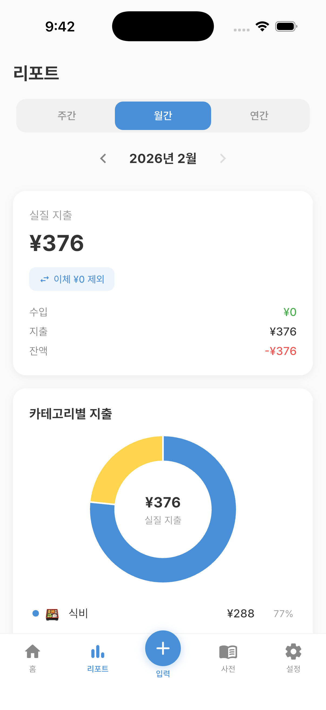
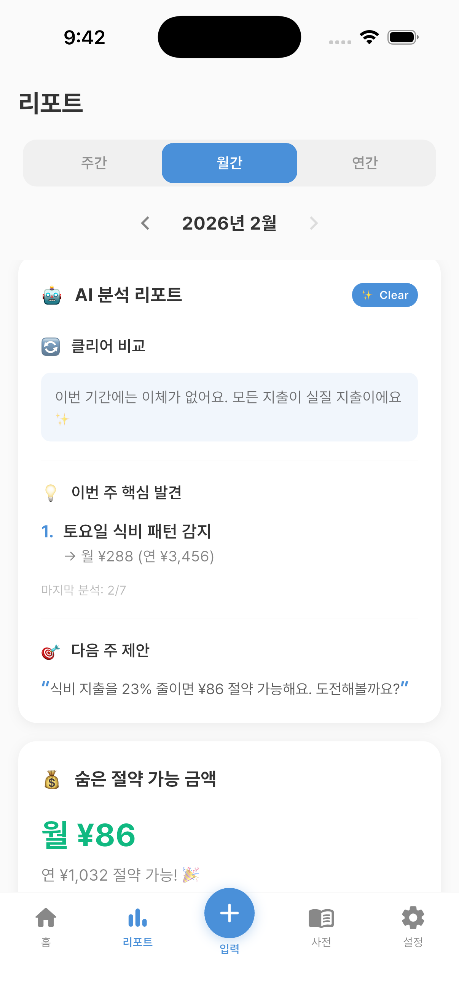
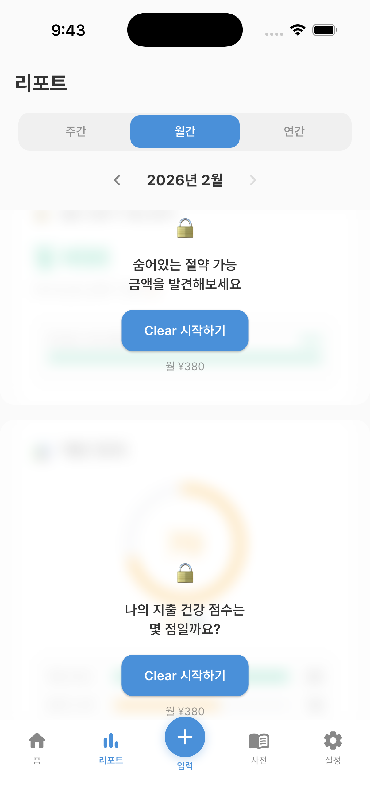
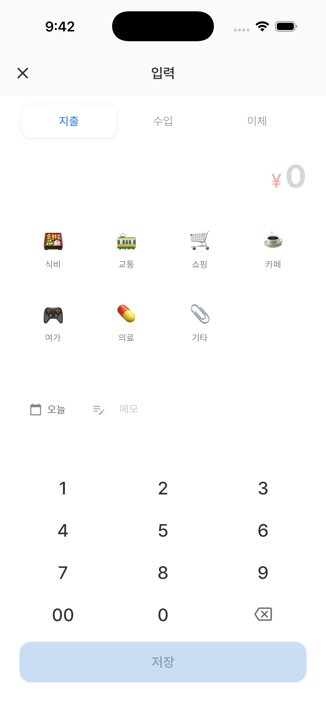
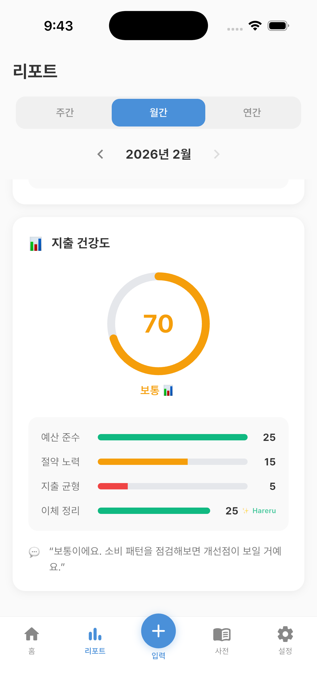
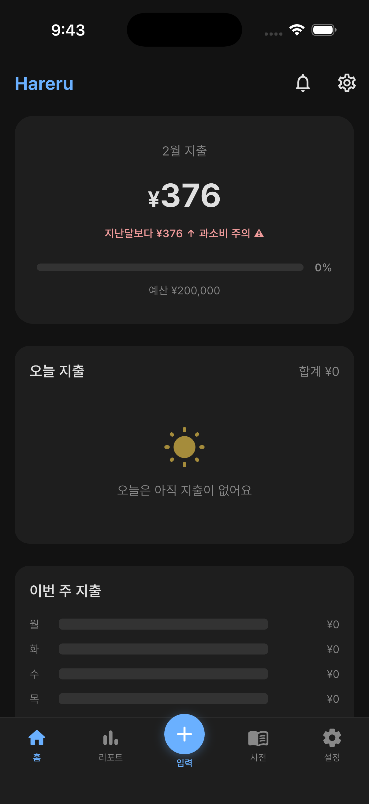

<!-- Language Selector -->
<p align="center">
  <a href="README.md">🇰🇷 한국어</a> | <b>🇺🇸 English</b> | <a href="README.ja.md">🇯🇵 日本語</a>
</p>

<!-- Logo -->
<p align="center">
  
</p>

<!-- Title -->
<h1 align="center">Hareru ハレル</h1>

<!-- Tagline -->
<p align="center">
  <b>See your real spending. Not the noise.</b><br>
  The expense tracker that filters out the clutter.
</p>

<!-- Badges -->
<p align="center">
  
  
  
  
  
</p>

---

<!-- Screenshots -->
<p align="center">
  
  
  
  
</p>

---

## The Problem

Every household finance app in Japan treats **internal bank transfers as expenses**.

Move ¥100,000 from your savings to your checking account? Congratulations — your app just told you that you "spent" ¥100,000 this month. Your reports are wrong. Your category breakdowns are polluted. Your monthly trends are meaningless.

> In a survey of 193 users who quit budgeting apps, 29.7% said the top reason was
> *"I couldn't feel any actual savings"* — because the data was never accurate in the first place.

---

## The Solution — Hareru

**Hareru automatically separates transfers from real spending**, giving you the clearest view of where your money actually goes.

No more polluted data. No more phantom expenses. Just clarity — like the sky clearing up after rain. ☀️

> 晴れる (hareru) = "to clear up" in Japanese.
> Clearing the fog around your finances.

---

## Features

### 🆓 Free — Everyone deserves accurate data

- **Auto transfer exclusion** — The core feature, free for everyone. No other app does this for free.
- **3-second expense entry** — Bottom sheet input with quick categories. No friction.
- **ClearView Reports** — Donut charts, spending trends, category breakdowns — all based on *real* spending.
- **Monthly insights** — Rule-based analysis: top spending days, category changes, patterns.
- **Dark mode** — Full dark theme support across all screens.
- **Multilingual** — Japanese 🇯🇵 / Korean 🇰🇷 / English 🇺🇸

### ✨ Clear (¥380/mo) — AI-powered insights

- **Clear Comparison** — See the difference: "other apps show ¥200,000 → Hareru shows ¥148,000"
- **AI Discoveries** — Weekly AI analysis finds hidden spending patterns (weekend dining, convenience store habits, unused subscriptions)
- **Saving Potential** — "You could save ¥26,000/month (¥312,000/year)" with specific action items
- **Health Score** — 100-point spending health gauge across 4 dimensions (budget adherence, saving effort, balance, transfer clarity)

### 🚀 Clear Pro (¥700/mo) — Coming in Phase 2

- **AI Coaching Bot** — Chat with AI about your finances in natural language
- **Custom saving goals** — Set and track personalized targets
- **Weekly/Monthly PDF reports** — Exportable AI analysis documents
- **Spending predictions** — Pattern-based forecasting

---

## Screenshots

| Home | Input | Report | AI Insight | Health Score | Blur (Free) | Dark Mode |
|:----:|:-----:|:------:|:----------:|:------------:|:-----------:|:---------:|
|  |  |  |  |  |  |  |

---

## Architecture

```
┌─────────────────────────────────────────────┐
│                   UI Layer                   │
│  Flutter + Riverpod + go_router             │
│  ┌──────┐ ┌──────┐ ┌──────┐ ┌───────────┐  │
│  │ Home │ │Input │ │Report│ │  Settings  │  │
│  └──────┘ └──────┘ └──────┘ └───────────┘  │
├─────────────────────────────────────────────┤
│               Business Logic                 │
│  ┌───────────────┐ ┌──────────────────────┐ │
│  │  Transaction   │ │   AI Insight Engine  │ │
│  │  Management    │ │  ┌────────────────┐  │ │
│  │  (CRUD + filter│ │  │ Health Score    │  │ │
│  │   + transfer   │ │  │ Calculator     │  │ │
│  │   detection)   │ │  ├────────────────┤  │ │
│  └───────────────┘ │  │ Insight        │  │ │
│                     │  │ Generator      │  │ │
│                     │  │ (Rule-based →  │  │ │
│                     │  │  AI API later) │  │ │
│                     │  └────────────────┘  │ │
│                     └──────────────────────┘ │
├─────────────────────────────────────────────┤
│                Data Layer                    │
│  ┌──────────────┐  ┌──────────────────────┐ │
│  │  Hive (Local) │  │  Firebase (Phase 2)  │ │
│  │  Transactions │  │  Auth + Cloud Sync   │ │
│  │  AI Cache     │  │  Premium Management  │ │
│  │  Settings     │  │                      │ │
│  └──────────────┘  └──────────────────────┘ │
└─────────────────────────────────────────────┘
```

### Tech Stack

| Layer | Technology |
|-------|-----------|
| Framework | Flutter 3.x (Dart) |
| State Management | Riverpod |
| Navigation | go_router |
| Local Storage | Hive |
| Charts | fl_chart |
| Internationalization | Flutter L10n (ARB) |
| Backend (Phase 2) | Firebase Auth + Firestore |
| AI (Phase 2) | Claude API (Anthropic) |

---

## Project Structure

```
lib/
├── main.dart
├── app.dart
├── shared/
│   ├── models/          # Transaction, AiInsight, Category
│   ├── services/        # AI insight generator, health calculator
│   └── theme/           # Light/Dark theme definitions
├── features/
│   ├── home/            # Home screen + weekly trends
│   ├── input/           # Expense entry bottom sheet
│   ├── report/          # ClearView report cards (1)~(8)
│   │   ├── providers/   # Report data + AI insight providers
│   │   └── widgets/     # Individual card widgets
│   ├── dictionary/      # Financial dictionary (Phase 2)
│   └── settings/        # App settings + premium toggle
├── l10n/                # ARB files (ko, ja, en)
└── router/              # go_router configuration
```

---

## Development Roadmap

- [x] Market research and competitive analysis
- [x] MVP PRD (14 sections)
- [x] Home screen (monthly summary + weekly trends)
- [x] Expense input (3-sec bottom sheet + Hive)
- [x] Settings (dark mode + multilingual)
- [x] Logo and splash screen
- [x] ClearView Report (cards 1~5)
- [x] AI Clear Insight premium cards (6~8)
- [x] Premium blur + CTA conversion flow
- [x] Pricing strategy (Free / Clear / Clear Pro)
- [ ] Firebase Authentication
- [ ] Financial dictionary tab
- [ ] Full L10n + App Store preparation
- [ ] TestFlight beta
- [ ] **App Store launch** 🚀

---

## Market Position

```
¥980 ── MoneyForward Advance
¥700 ── 🔵 Hareru Clear Pro (AI coaching, cheaper than MF)
¥540 ── MoneyForward Standard
¥500 ── Rakuten Kakeibo
¥480 ── OneBank Plus
¥430 ── Moneytree Grow
¥380 ── 🔵 Hareru Clear (AI insights included, below market)
¥365 ── Zaim Premium
  ¥0 ── 🔵 Hareru Free (auto transfer exclusion — no competitor offers this free)
```

---

## Why "Hareru"?

**晴れる (hareru)** means "to clear up" in Japanese — like clouds parting to reveal blue sky.

Your finances are cloudy with phantom expenses, wrong totals, and polluted data. Hareru clears that up, showing you only what's real.

The name works across our target markets:

- 🇯🇵 Japanese users immediately understand the meaning
- 🇰🇷 Korean users hear a soft, approachable sound
- 🇺🇸 English speakers find it memorable and unique

---

## Target Users

- **Primary:** Japanese residents aged 20-30 who've tried (and quit) budgeting apps
- **Secondary:** Foreign residents in Japan navigating Japanese financial systems
- **Platform:** iOS first (Japan's iOS market share ~65%), Android in Phase 2

---

## License

This is a proprietary project. All rights reserved.

---

<!-- Footer -->
<p align="center">
  <b>Hareru ハレル</b><br>
  <em>Clear your finances. See what's real.</em><br><br>
  お金のもやもやを、晴らそう。
</p>
